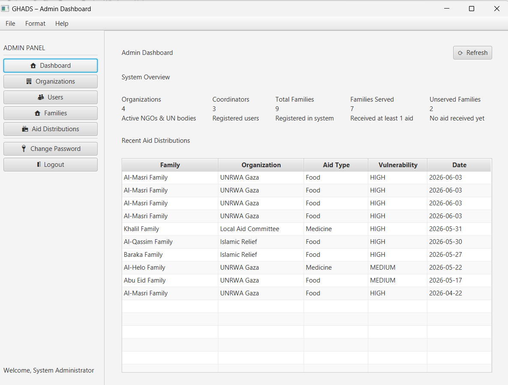
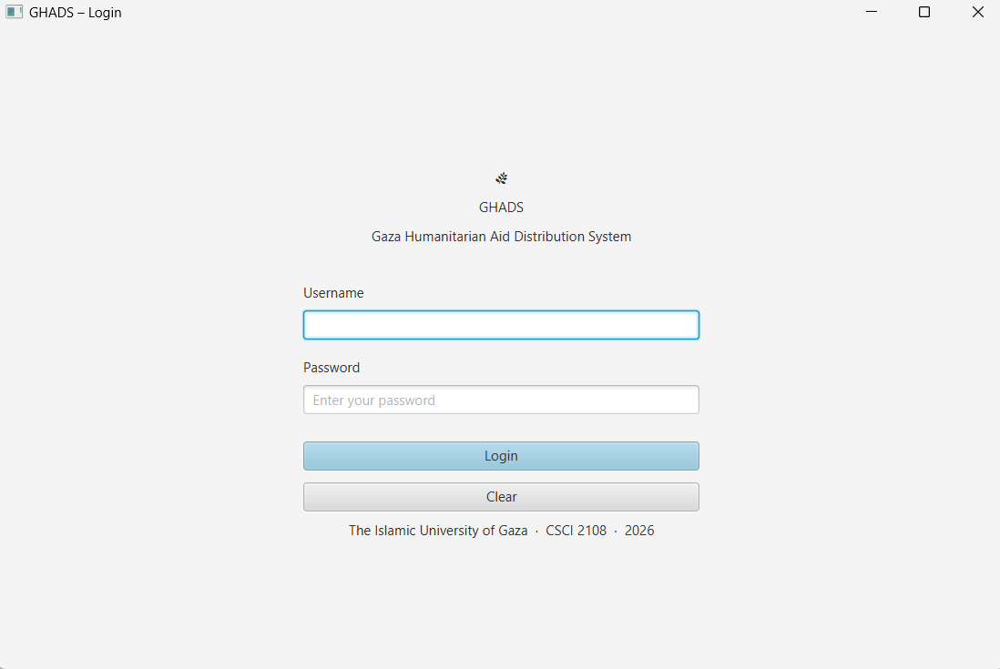
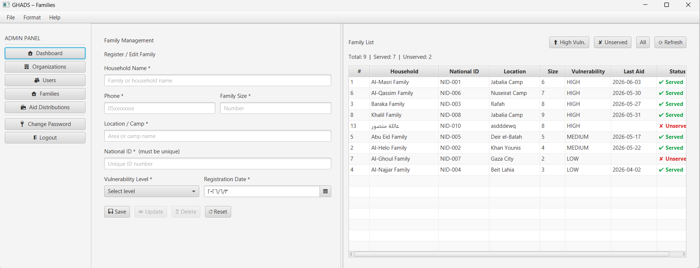

# 🇵🇸 GHADS — Gaza Humanitarian Aid Distribution System

<p align="center">
  
</p>

> A centralized desktop application built in Java that helps humanitarian organizations in Gaza coordinate aid distribution for displaced families — ensuring fairness, transparency, and zero duplication.

---

## 📌 The Problem

When multiple humanitarian organizations operate independently, the same family may receive aid multiple times while another family receives nothing at all.

**GHADS solves this** by maintaining one shared database for all organizations, with an automatic duplicate-check before every distribution.

---

## ✅ The Solution

A role-based desktop system where:
- Every displaced family is registered **once** in a shared database
- Every aid distribution is **logged** with who gave it, when, and from which organization
- The system **automatically rejects** duplicate distributions based on vulnerability level and aid type
- Admins and Coordinators each have their **own dashboard** with relevant statistics

---

## 🖥️ System Screenshots

| Login | Admin Dashboard |
|-------|----------------|
|  |  |

| Families | 
|----------|
|  

---

## 👥 User Roles

| Role | Responsibilities |
|------|-----------------|
| **Admin** | Manages organizations, users, families, and views all distributions system-wide |
| **Coordinator** | Registers families, records aid distributions, runs duplicate check |

---

## ⭐ Key Feature — Duplicate Check

Before saving any aid distribution, the system automatically checks:

```
Is the family's vulnerability level HIGH?
    ├── YES → ✅ Always allowed (urgent need)
    └── NO (MEDIUM or LOW)
            Did they receive the SAME aid type within the last 30 days?
                ├── YES → ❌ REJECTED — Alert shown with full details
                └── NO  → ✅ Allowed (different type or >30 days ago)
```

The rejection alert shows:
- Family name
- Vulnerability level
- Aid type already received
- Organization that gave it
- Date it was given

---

## 🏗️ Architecture

```
GHADS/
├── model/          → Data classes (Family, User, Organization, AidDistribution)
├── view/           → FXML files built with Scene Builder + CSS
├── controller/     → JavaFX Controllers (MVC)
├── dao/            → DAO Interfaces
├── dao/impl/       → JDBC Implementations (CRUD)
├── service/        → Business Logic (Duplicate Check)
├── config/         → DatabaseConnection (Singleton)
└── util/           → AlertHelper, SceneManager, SessionManager, ThemeManager
```

### Design Patterns Used
| Pattern | Where | Why |
|---------|-------|-----|
| **MVC** | Entire application | Separation of concerns |
| **DAO** | Database layer | Decouples business logic from SQL |
| **Singleton** | DatabaseConnection | One connection instance only |

---

## 🛠️ Technologies Used

| Technology | Purpose |
|-----------|---------|
| Java 21 | Core language |
| JavaFX | Desktop UI framework |
| Scene Builder | FXML visual design |
| CSS | Styling + Dark/Light themes |
| MySQL | Database |
| JDBC | Database connectivity |
| Maven | Build and dependency management |

---

## 🗄️ Database Schema

```
ghads_db
├── organizations    (org_id, name, type, contact_info)
├── users            (user_id, username, password, full_name, email, role, org_id, photo_path)
├── families         (family_id, household_name, phone, location, family_size,
│                     national_id, vulnerability_level, registration_date, last_aid_date)
└── aid_distributions (distribution_id, family_id, org_id, distributed_by,
                        distribution_date, aid_type, notes)
```

---

## 🚀 How to Run

### Prerequisites
- Java JDK 21
- JavaFX SDK
- MySQL / XAMPP
- NetBeans IDE 21 (or IntelliJ)

### Steps

**1. Set up the database:**
```sql
-- Open MySQL Workbench or phpMyAdmin
-- Import: database/ghads_schema.sql
-- This creates ghads_db with all tables and sample data
```

**2. Configure database connection:**
```java
// src/main/java/com/ghads/config/DatabaseConnection.java
private static final String PASSWORD = "your_mysql_password"; // change this
```

**3. Run the project:**
```
NetBeans → Right-click project → Run
```

### Default Login Credentials

| Role | Username | Password |
|------|----------|----------|
| Admin | `admin` | `admin1234` |
| Coordinator 1 | `coord1` | `coord1234` |
| Coordinator 2 | `coord2` | `coord1234` |
| Coordinator 3 | `coord3` | `coord1234` |

---

## 📋 Features Checklist

### Admin
- [x] Login with role-based redirect
- [x] Dashboard with system-wide statistics
- [x] Full CRUD — Organizations
- [x] Full CRUD — Users (Coordinators)
- [x] Full CRUD — Families (with National ID uniqueness check)
- [x] View all distributions + filter by organization
- [x] Change password with validation
- [x] Logout

### Coordinator
- [x] Login with organization-scoped dashboard
- [x] Dashboard with organization statistics
- [x] Register new families (with National ID uniqueness check)
- [x] Record aid distributions
- [x] ⭐ Automatic duplicate check before every distribution
- [x] View/Edit profile
- [x] Change password
- [x] Logout

### UI / UX
- [x] Menu Bar on every screen (File, Format, Help)
- [x] Dark / Light theme toggle
- [x] Font size and family controls
- [x] Confirmation dialogs before delete
- [x] Success/Error alerts after every operation
- [x] Reset buttons on all forms
- [x] Full input validation

### Bonus
- [x] Aid Type Deduplication (smarter duplicate check by type)
- [x] Photo field in User table

---

## 📁 Project Structure

```
GHADS/
├── pom.xml
├── database/
│   └── ghads_schema.sql
└── src/main/
    ├── java/com/ghads/
    │   ├── MainApp.java
    │   ├── config/        (DatabaseConnection)
    │   ├── model/         (4 classes)
    │   ├── dao/           (4 interfaces)
    │   ├── dao/impl/      (4 implementations)
    │   ├── service/       (AidDistributionService)
    │   ├── controller/    (12 controllers)
    │   └── util/          (5 utility classes)
    └── resources/com/ghads/
        ├── fxml/          (10 screens)
        └── css/           (style.css, light.css, dark.css)
```

---

## 🎓 Academic Info

| | |
|-|-|
| **Course** | Programming III Lab — CSCI 2108 |
| **Institution** | The Islamic University of Gaza |
| **Instructor** | Aya N. Alharazin |
| **Year** | 2026 |

---

> *"We learn tools to solve real problems in our lives — and that is what makes coding truly powerful and meaningful."*
> — Aya N. Alharazin
